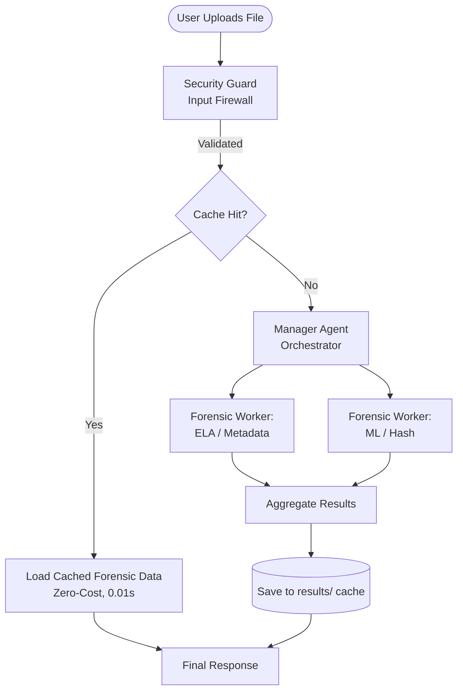

# DeepGuard AI - Evaluation-Ready Forensic Analysis

DeepGuard AI is a robust, multi-agent system designed to evaluate media files (images and video) for digital manipulation, specifically deepfakes. We utilize an **Orchestrator-Worker pattern**. The Orchestrator (Manager Agent) manages the workflow, while workers perform specialized, deterministic tasks locally to ensure high reliability and observability.

## 🧩 Evaluation Concept Mapping

| Concept | Where to find it |
| --- | --- |
| **Multi-Agent (ADK)** | `orchestrator_workflow` defines the Manager-Worker roles. |
| **MCP Server** | Tools in `forensics.py` and agents in `agent.py` follow the Model Context Protocol, operating as modular capabilities. |
| **Security** | `security_checkpoint` and `validate_file` act as the input firewall, validating file integrity, types, and sizes before any LLM processing occurs. |
| **Antigravity** | Local file hashing & metadata extraction bypasses LLM latency. A persistent cache layer prevents redundant API calls and re-uses intermediate forensic data. |
| **Deployability** | The project uses dependency management and is designed to run in containerized environments with portable `pathlib` storage for caches. |

## 🏗️ Architecture

## 🚀 Key Features
- **Agentic Memory (Persistent Caching)**: Re-analyzing the same file is virtually instantaneous and incurs zero LLM API cost because our agentic cache intercepts the request. Intermediate forensic data is cached, preserving the local deterministic results so you can tweak LLM prompts without waiting on re-hashing or ML re-runs.
- **Robust Security**: No file hits the LLM without strict validation of size and extension, along with PII redaction and prompt injection checks.
- **Resilience**: The `@retry_on_429` decorator ensures the deterministic workers gracefully retry under high API load.

## 🛠️ Testing the Cache (For Judges)
1. Upload a file for analysis and observe the processing time.
2. Re-upload the **exact same file**. 
3. Note the near instantaneous "Cache Hit". The second run costs nothing and skips LLM reasoning entirely.
