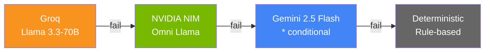
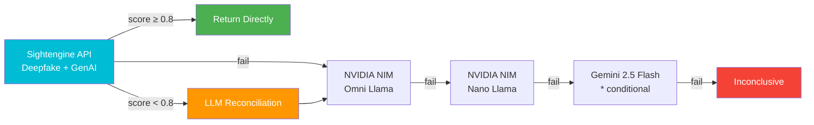

# 🛡️ DeepGuard AI

> **Multi-Agent Deepfake Detection Pipeline**

<p align="center">
  
  
  
  
  
  
  
  
  
  <br>
  <a href="#"></a>
</p>


```text

██████╗ ███████╗███████╗██████╗  ██████╗ ██╗   ██╗ █████╗ ██████╗ ██████╗      █████╗ ██╗
██╔══██╗██╔════╝██╔════╝██╔══██╗██╔════╝ ██║   ██║██╔══██╗██╔══██╗██╔══██╗    ██╔══██╗██║
██║  ██║█████╗  █████╗  ██████╔╝██║  ███╗██║   ██║███████║██████╔╝██║  ██║    ███████║██║
██║  ██║██╔══╝  ██╔══╝  ██╔═══╝ ██║   ██║██║   ██║██╔══██║██╔══██╗██║  ██║    ██╔══██║██║
██████╔╝███████╗███████╗██║     ╚██████╔╝╚██████╔╝██║  ██║██║  ██║██████╔╝    ██║  ██║██║
╚═════╝ ╚══════╝╚══════╝╚═╝      ╚═════╝  ╚═════╝ ╚═╝  ╚═╝╚═╝  ╚═╝╚═════╝     ╚═╝  ╚═╝╚═╝

```

---

## 📋 Project Overview

**DeepGuard AI** is a multi-agent deepfake detection system built on Google's **ADK (Agent Development Kit)**. It uses a pipeline of three specialized AI agents — **Router**, **Analysis**, and **Report** — to detect manipulated media (images and videos) with high accuracy and explainability.

### The Problem

Deepfakes — AI-generated or manipulated media that convincingly replaces a person's likeness — have become a serious threat to trust in digital content. From political disinformation and financial fraud to identity theft and non-consensual imagery, the ability to generate photorealistic fakes has outpaced traditional detection methods. Modern generative models (GANs, diffusion models) can produce media indistinguishable from reality to the human eye.

### Why an Agentic Pipeline?

Deepfake detection requires more than a single model or API call. It requires:
- **Reasoning** about context (metadata, lighting, compression artifacts)
- **Fusion** of multiple forensic signals (frequency analysis, noise patterns, EXIF inspection)
- **Graceful degradation** — if one provider is down or rate-limited, the system should fall through to the next

DeepGuard meets these needs with a **modular, agent-driven architecture**. Each agent has a specific responsibility, fault-tolerant fallback chains, and session isolation so that failures in one stage don't cascade. The pipeline is extensible — new providers or forensic tools can be added without touching existing agent logic.

---

## ✨ Key Features

| Feature | Description |
|---------|-------------|
| 🤖 **AI Agent Pipeline** | Three Google ADK agents (Router → Analysis → Report) with isolated sessions |
| 🔄 **Multi-Provider LLM Fallback** | Router & Report agents fall through Groq → NVIDIA NIM → Gemini → Deterministic |
| 🔌 **Sightengine Integration** | REST API-based deepfake/genAI detection as the analysis primary |
| 🔬 **Hybrid Forensic Analysis** | 8+ computer vision tools: ELA, FFT, noise profiling, EXIF, JPEG artifact analysis, clone detection, wavelet decomposition, edge detection |
| ⚖️ **Confidence Gate + Fusion** | `≥0.8` confidence returns directly; `<0.8` triggers LLM reconciliation of forensic + API signals |
| 🧩 **Fallback Architecture** | Every provider stage has 3+ fallbacks; network failures, rate limits, and timeouts are handled transparently |
| 🖥️ **Interactive Frontend** | React 19 + TypeScript + Tailwind CSS dashboard for file upload, result visualization, and report download |
| 📄 **Multi-Format Reports** | Structured JSON, formatted Markdown, and printable PDF outputs with audit trail |
| 🚀 **Deployment-Ready** | Docker images, Google Cloud Run config, Vercel frontend, optional Terraform infrastructure |

---

## 🏗️ System Architecture

### Agent Pipeline Flow


```mermaid
flowchart LR
    U[User] --> FA[FastAPI Gateway]
    FA --> G[Guardrails<br/>Injection Detection<br/>PII Redaction<br/>File Validation]
    G --> PP[Preprocessing<br/>OpenCV / PIL<br/>Frame Extraction]
    PP --> FC[Forensic Context<br/>ELA · FFT · Noise · EXIF<br/>JPEG Artifacts · Clone<br/>Wavelet · Edge Detection]
    FC --> RA[Router Agent<br/>Media Classification]
    RA --> AA[Analysis Agent<br/>Deepfake Scoring]
    AA --> RepA[Report Agent<br/>Explanation + Report]
    RepA --> OA[Output Assembly<br/>JSON / MD / PDF]
    OA --> R[Response]

    style RA fill:#4a90d9,color:#fff
    style AA fill:#e65c4f,color:#fff
    style RepA fill:#4caf50,color:#fff
```

### Provider Fallback Chains

**Router & Report Agents:**


```mermaid
flowchart LR
    P1[Groq<br/>Llama 3.3-70B] -->|fail| P2[NVIDIA NIM<br/>Omni Llama]
    P2 -->|fail| P3[Gemini 2.5 Flash<br/>* conditional]
    P3 -->|fail| P4[Deterministic<br/>Rule-based]
    style P1 fill:#f7931e,color:#fff
    style P2 fill:#76b900,color:#fff
    style P3 fill:#4285f4,color:#fff
    style P4 fill:#666,color:#fff
```

> **Note:** The Gemini fallback requires `ENABLE_GEMINI_FALLBACK=true` and a valid `GOOGLE_API_KEY`.

**Analysis Agent:**


```mermaid
flowchart LR
    A1[Sightengine API<br/>Deepfake + GenAI] -->|score ≥ 0.8| RETURN[Return Directly]
    A1 -->|score < 0.8| RECONCILE[LLM Reconciliation]
    A1 -->|fail| A2[NVIDIA NIM<br/>Omni Llama]
    A2 -->|fail| A3[NVIDIA NIM<br/>Nano Llama]
    A3 -->|fail| A4[Gemini 2.5 Flash<br/>* conditional]
    A4 -->|fail| INC[Inconclusive]
    RECONCILE --> A2
    style A1 fill:#00bcd4,color:#fff
    style RETURN fill:#4caf50,color:#fff
    style RECONCILE fill:#ff9800,color:#fff
    style INC fill:#f44336,color:#fff
```

---

## 📁 Folder Structure

```
deepguard-ai/
├── backend/
│   ├── app/
│   │   ├── agents/             # ADK agent definitions + provider factory
│   │   ├── guardrails/         # Input validation, injection detection, schema enforcement
│   │   ├── preprocessing/      # Image/video computer vision pipeline
│   │   ├── providers/          # Sightengine API client
│   │   ├── services/           # Report builder (JSON/MD/PDF), audit logging
│   │   ├── tools/              # Forensic tools (ELA, EXIF, FFT, noise, clone, etc.)
│   │   ├── api.py              # FastAPI entry point
│   │   ├── config.py           # Pydantic settings from .env
│   │   └── runner.py           # ADK orchestrator with fallback chains
│   ├── tests/
│   │   ├── eval/               # Evaluation suite
│   │   └── ...                 # Unit tests + E2E tests
├── frontend/                   # React 19 + Vite + TypeScript UI
├── deployment/                 # Docker, Cloud Run, Vercel, Terraform
├── docs/                       # Architecture docs, command reference
├── eval_dataset/               # Evaluation dataset and results
├── .env.example                # Environment variable template
├── .gitignore
├── Dockerfile
├── KNOWN_LIMITATIONS.md        # Documented system limitations
├── pyproject.toml
└── uv.lock
```

---

## 🛠️ Technology Stack

| Category | Technology | Purpose |
|----------|-----------|---------|
| **Language** | Python 3.11+ | Backend runtime |
| **Web Framework** | FastAPI 0.115 | REST API server |
| **Agent Framework** | Google ADK 0.4 | Multi-agent orchestration |
| **LLM Providers** | Groq (Llama 3.3-70B) | Router & Report primary LLM |
| **LLM Providers** | NVIDIA NIM (Omni + Nano) | Fallback LLM inference |
| **LLM Providers** | Gemini 2.5 Flash | Conditional fallback LLM |
| **Analysis API** | Sightengine | Deepfake/genAI REST API |
| **Forensics** | OpenCV, Pillow (PIL) | Image processing & CV tools |
| **Reports** | fpdf2 | PDF generation |
| **Async HTTP** | aiohttp | Async API calls |
| **Frontend** | React 19 + Vite + TypeScript | Web UI |
| **Styling** | Tailwind CSS | UI component styling |
| **Container** | Docker | Local containerization |
| **Deployment** | Google Cloud Run | Backend serverless hosting |
| **Deployment** | Vercel | Frontend static hosting |
| **Infrastructure** | Terraform (optional) | IaC provisioning |
| **Package Manager** | uv | Python dependency management |

---

## 🚀 Installation

### Prerequisites

- **Python 3.11+** installed ([download](https://python.org))
- **uv** package manager: `pip install uv` or `curl -LsSf https://astral.sh/uv/install.sh | sh`
- **Node.js 20+** (for frontend)
- A **Sightengine** account (free tier) — get API credentials at [sightengine.com](https://sightengine.com)

### Setup Steps

```bash
# 1. Clone the repository
git clone https://github.com/your-org/deepguard-ai.git
cd deepguard-ai

# 2. Install Python dependencies
uv sync

# 3. Configure environment variables
cp .env.example .env
# Edit .env with your API keys:
#   SIGHTENGINE_API_USER=your_user
#   SIGHTENGINE_API_SECRET=your_secret
#   GROQ_API_KEY=gsk_your_key
#   PRIMARY_API_KEY=your_api_key

# 4. Start the backend (from the backend/ directory)
cd backend
uv run uvicorn app.api:app --reload --port 8000

# 5. In a separate terminal — start the frontend
cd frontend
npm install
npm run dev

# 6. Verify the backend is running
curl http://localhost:8000/health
```

> **Expected response:** `{"status": "ok"}`

### API Endpoints

| Method | Path | Description |
|--------|------|-------------|
| `GET` | `/health` | Health check |
| `GET` | `/livez` | Liveness probe |
| `GET` | `/health/ready` | Readiness check |
| `GET` | `/readyz` | Readiness probe (alias) |
| `POST` | `/api/analyze` | Submit media for deepfake analysis |

### Running Tests

```bash
cd backend
uv run pytest tests/ -v
```

---

## 📦 Deployment

| Method | Target | Guide |
|--------|--------|-------|
| 🐳 **Docker** | Local container | `deployment/docker/README.md` |
| ☁️ **Cloud Run** | Backend (serverless) | `deployment/cloud_run/README.md` |
| ▲ **Vercel** | Frontend (static) | `deployment/vercel/README.md` |
| 🏗️ **Terraform** | Full infrastructure (optional) | `deployment/terraform/README.md` |
| 🔀 **Hybrid** | Cloud Run + Vercel | `deployment/README.md` |

---

## 📊 Evaluation Results

| Metric | Value |
|--------|-------|
| **Overall Accuracy** | **65%** |
| Image Accuracy | 100% |
| Video Accuracy | 30% |
| Dataset Size | TBD |

> **⚠️ Known Limitation:** Video accuracy (30%) is significantly lower than image accuracy due to temporal inconsistencies and frame-to-frame analysis challenges. See [eval_dataset/results.md](eval_dataset/results.md) for detailed evaluation data.

---

## 🗺️ Roadmap

- [x] Multi-agent pipeline with Google ADK
- [x] Sightengine API integration
- [x] Forensic tool suite (ELA, FFT, noise, etc.)
- [x] PDF/MD/JSON report generation
- [x] Docker + Cloud Run + Vercel deployment
- [ ] **Video accuracy improvement** — Temporal coherence analysis, frame fusion strategies
- [ ] **ML ensemble fusion** — Weighted voting across multiple detection signals
- [ ] **Custom model fine-tuning** — Train specialized classifiers on curated deepfake datasets
- [ ] **Multi-language reports** — Localized output for international users
- [ ] **Real-time streaming** — WebSocket-based live analysis pipeline
- [ ] **CI/CD pipeline** — Automated testing, build, and deployment with GitHub Actions

---

## 🤝 Contributing

Contributions are welcome! To get started:

1. **Fork** the repository
2. **Create a feature branch**: `git checkout -b feature/your-feature`
3. **Commit your changes**: `git commit -m "feat: add your feature"`
4. **Push to the branch**: `git push origin feature/your-feature`
5. **Open a Pull Request**

Please ensure your code passes existing tests (`uv run pytest tests/ -v`) and follows the project's coding conventions. For major changes, open an issue first to discuss what you'd like to change.

---

## 📄 License

```
MIT License

Copyright (c) 2026 DeepGuard AI

Permission is hereby granted, free of charge, to any person obtaining a copy
of this software and associated documentation files (the "Software"), to deal
in the Software without restriction, including without limitation the rights
to use, copy, modify, merge, publish, distribute, sublicense, and/or sell
copies of the Software, and to permit persons to whom the Software is
furnished to do so, subject to the following conditions:

The above copyright notice and this permission notice shall be included in all
copies or substantial portions of the Software.

THE SOFTWARE IS PROVIDED "AS IS", WITHOUT WARRANTY OF ANY KIND, EXPRESS OR
IMPLIED, INCLUDING BUT NOT LIMITED TO THE WARRANTIES OF MERCHANTABILITY,
FITNESS FOR A PARTICULAR PURPOSE AND NONINFRINGEMENT. IN NO EVENT SHALL THE
AUTHORS OR COPYRIGHT HOLDERS BE LIABLE FOR ANY CLAIM, DAMAGES OR OTHER
LIABILITY, WHETHER IN AN ACTION OF CONTRACT, TORT OR OTHERWISE, ARISING FROM,
OUT OF OR IN CONNECTION WITH THE SOFTWARE OR THE USE OR OTHER DEALINGS IN THE
SOFTWARE.
```

---

<p align="center">
  Built with ❤️ using <a href="https://google.github.io/adk-docs/">Google ADK</a>
</p>
