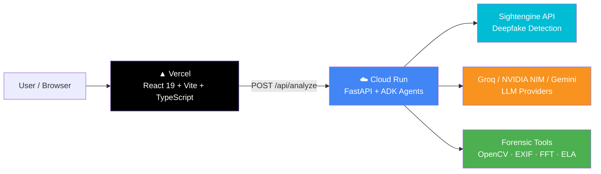

# DeepGuard AI — Deployment Guide

## Deployment Targets

| Target | Component | Provider | Method | Doc |
|--------|-----------|----------|--------|-----|
| ☁️ Cloud Run | Backend (FastAPI + ADK agents) | Google Cloud | `gcloud run deploy` or CI/CD | [`CLOUD_RUN.md`](CLOUD_RUN.md) |
| ▲ Vercel | Frontend (React 19 + Vite + TS) | Vercel | GitHub integration (auto-deploy) | [`VERCEL.md`](VERCEL.md) |
| 🏗️ Terraform | Full GCP infra (optional) | HashiCorp | `terraform apply` | `terraform/README.md` |

## Deployment Methods

- **Cloud Run (Backend)** — Single container running FastAPI with four in-process ADK agents (Router → Analysis → Supervisor → Report). Deployed via `gcloud run deploy`. Scales to zero when idle. No inter-service RPC — agents communicate in-process, keeping latency low. The Supervisor agent drives a bounded investigation loop (max 2 rounds) for conflicting evidence.

- **Vercel (Frontend)** — Static site built with `npm run build` from `frontend/`. Connected via GitHub integration; auto-deploys on every push to `main`. Preview deployments per branch.

- **Terraform (Optional)** — Infrastructure-as-Code templates in `deployment/terraform/` for provisioning the full GCP project (Cloud Run, storage, telemetry). Not required for deployment.

## Environment Variables

| Variable | Required | Scope | Description |
|----------|----------|-------|-------------|
| `SIGHTENGINE_API_USER` | Yes | Analysis | Sightengine API username |
| `SIGHTENGINE_API_SECRET` | Yes | Analysis | Sightengine API secret |
| `GROQ_API_KEY` | Yes | Router + Report | Groq API key (primary LLM) |
| `PRIMARY_API_KEY` | Yes | Analysis | NVIDIA NIM API key (fallback) |
| `GOOGLE_API_KEY` | Conditional | All | Gemini API key (if fallback enabled) |
| `FRONTEND_URL` | Yes | CORS | Vercel frontend URL |
| `TAVILY_API_KEY` | No | Search | Web search tool key |
| `LOG_LEVEL` | No | Logging | `DEBUG`, `INFO`, `WARNING` (default: `INFO`) |
| `REQUEST_TIMEOUT_SECONDS` | No | Timeout | Per-request timeout (default: `240`) |
| `MAX_FILE_SIZE_MB` | No | Upload | Max file size in MB (default: `100`) |
| `ENABLE_GEMINI_FALLBACK` | No | Routing | Set `true` to enable Gemini fallback tier |
| `CORS_ORIGINS` | No | CORS | Extra CORS origins (comma-separated) |
| `MAX_RETRIES_PRIMARY` | No | Retry | Retry count before fallback (default: `2`) |
| `RATE_LIMIT_PER_MINUTE` | No | Rate limit | Max requests per minute (default: `20`) |
| `PII_REDACTION_ENABLED` | No | Security | PII redaction toggle (default: `true`) |
| `INJECTION_DETECTION_ENABLED` | No | Security | Injection detection toggle (default: `true`) |

> 💡 See [`backend/app/config.py`](../backend/app/config.py) for the full settings schema — every field maps to an uppercase env var.

## Health Check Endpoints

| Endpoint | Type | Response |
|----------|------|----------|
| `GET /health` | General health | `{"status": "ok"}` |
| `GET /livez` | Liveness probe (alias) | `{"status": "ok"}` |
| `GET /health/ready` | Readiness | `{"status": "ready"}` |
| `GET /readyz` | Readiness probe (alias) | `{"status": "ready"}` |
| `GET /` | Root info | `{"message": "DeepGuard AI API is running", "version": "3.0.0"}` |

## Timeout Reference

| Timeout | Value | Scope |
|---------|-------|-------|
| Cloud Run request timeout | `120s` | Platform level (max request duration) |
| App-level timeout | `240s` | `REQUEST_TIMEOUT_SECONDS` in env |
| Eval script timeout | `300s` | `backend/tests/eval/` scripts |
| Docker HEALTHCHECK interval | `30s` | Container health polling |

## Next Steps

- [Deploy backend to Cloud Run](CLOUD_RUN.md)
- [Deploy frontend to Vercel](VERCEL.md)
- [Verify deployment](verify_deploy.py)
