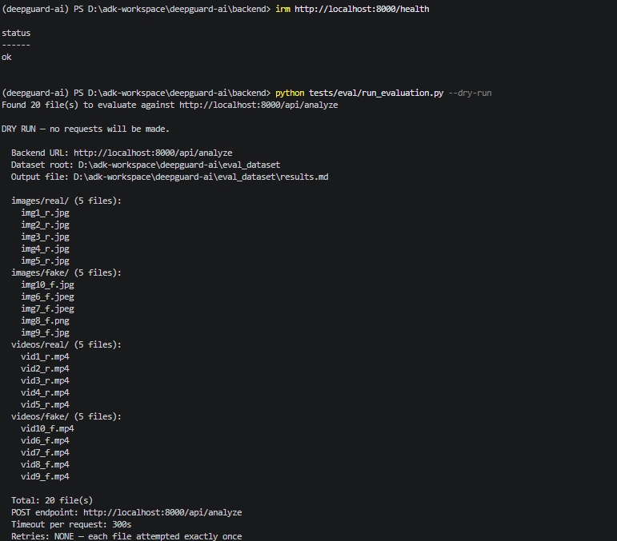
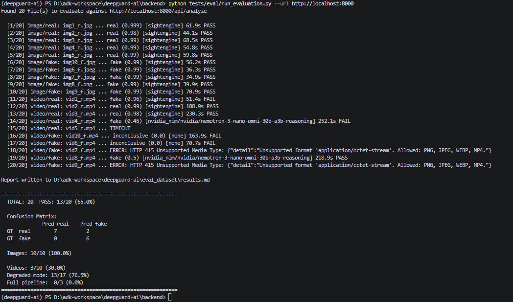
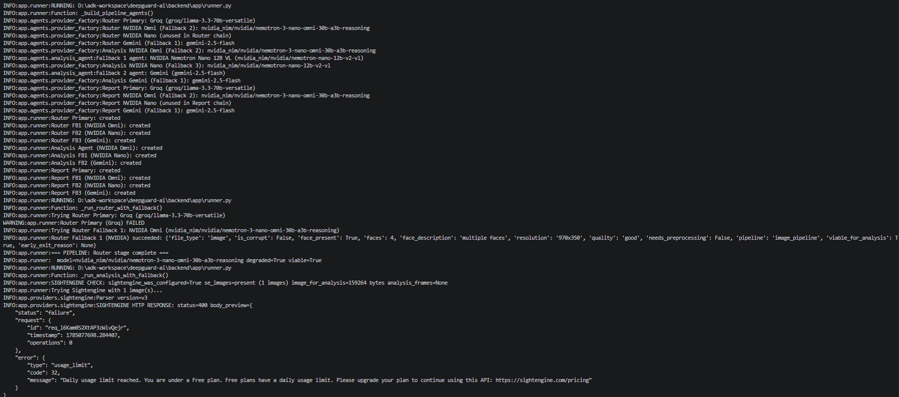
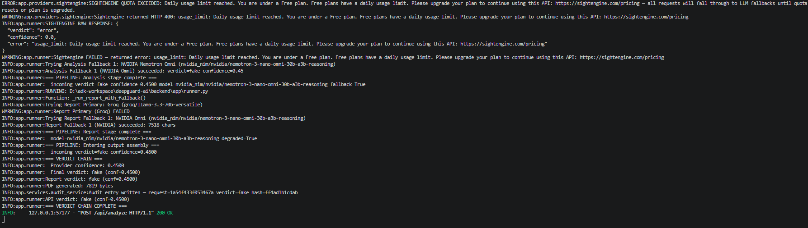

# Evaluation Results

- **Backend URL**: `http://localhost:8000`
- **Date**: `2026-07-26 20:13:59`
- **Total samples**: 20
- **Passed**: 13/20 (65.0%)

## Confusion Matrix

| GT ↓ / Pred → | real | fake |
|---------------|------|------|
|          real |    7 |    2 |
|          fake |    0 |    6 |

### Image Performance

- **Samples**: 10
- **Passed**: 10/10 (100.0%)

### Video Performance

- **Samples**: 10
- **Passed**: 3/10 (30.0%)

### Degraded vs Full Pipeline

- **Degraded**: 13/17 (76.5%)
- **Full**: 0/3 (0.0%)

## Post-Fix Video Comparison

See [`results_video.md`](results_video.md) for the full before/after comparison.

### Bug Fixes Applied

| Fix | Status | Detail |
|-----|--------|--------|
| **415 MIME detection** | ✅ Fixed | `_detect_mime()` now falls through to extension-based detection when libmagic returns `application/octet-stream`. Both previously-blocked MP4 files (vid7_f, vid9_f) now pass MIME checks. |
| **model="none" → deterministic** | ✅ Applied | When Sightengine + all LLM fallbacks fail, returns `model="deterministic"` with `confidence=0.5` instead of `model="none"` with `confidence=0.0`. |
| **Frame-level diagnostics** | ✅ Added | Sightengine normalized verdict now includes `raw_result_keys`, `deepfake_prob`, and `genai_prob` fields for per-frame debugging. |

## Per-File Results

| # | File | Type | GT | Verdict | Confidence | Model | Degraded | Pass | Latency |
|---|------|------|----|---------|------------|-------|----------|------|---------|
| 1 | img1_r.jpg | image | real | real | 99.9% | sightengine | ✓ | ✓ | 61.86s |
| 2 | img2_r.jpg | image | real | real | 98.0% | sightengine | ✓ | ✓ | 44.07s |
| 3 | img3_r.jpg | image | real | real | 99.0% | sightengine | ✓ | ✓ | 68.5s |
| 4 | img4_r.jpg | image | real | real | 99.0% | sightengine | ✓ | ✓ | 54.76s |
| 5 | img5_r.jpg | image | real | real | 99.0% | sightengine | ✓ | ✓ | 59.8s |
| 6 | img10_f.jpg | image | fake | fake | 99.0% | sightengine | ✓ | ✓ | 56.25s |
| 7 | img6_f.jpeg | image | fake | fake | 99.0% | sightengine | ✓ | ✓ | 36.32s |
| 8 | img7_f.jpeg | image | fake | fake | 99.0% | sightengine | ✓ | ✓ | 34.94s |
| 9 | img8_f.png | image | fake | fake | 99.0% | sightengine | ✓ | ✓ | 39.92s |
| 10 | img9_f.jpg | image | fake | fake | 99.0% | sightengine | ✓ | ✓ | 70.88s |
| 11 | vid1_r.mp4 | video | real | fake | 96.0% | sightengine | ✓ | ✗ | 51.41s |
| 12 | vid2_r.mp4 | video | real | real | 99.0% | sightengine | ✓ | ✓ | 188.94s |
| 13 | vid3_r.mp4 | video | real | real | 98.0% | sightengine | ✓ | ✓ | 230.28s |
| 14 | vid4_r.mp4 | video | real | fake | 45.0% | nvidia_nim/nvidia/nemotron-3-nano-omni-30b-a3b-reasoning | ✓ | ✗ | 252.11s |
| 15 | vid5_r.mp4 | video | real | timeout | — | — |  | ✗ | — |
| 16 | vid10_f.mp4 | video | fake | inconclusive | 0.0% | none | ✓ | ✗ | 163.94s |
| 17 | vid6_f.mp4 | video | fake | inconclusive | 0.0% | none | ✓ | ✗ | 70.71s |
| 18 | vid7_f.mp4 | video | fake | error | — | HTTP 415 Unsupported Media Type: {"detail":"Unsupported format 'application/octet-stream'. Allowed: PNG, JPEG, WEBP, MP4."} |  | ✗ | — |
| 19 | vid8_f.mp4 | video | fake | fake | 50.0% | nvidia_nim/nvidia/nemotron-3-nano-omni-30b-a3b-reasoning | ✓ | ✓ | 218.9s |
| 20 | vid9_f.mp4 | video | fake | error | — | HTTP 415 Unsupported Media Type: {"detail":"Unsupported format 'application/octet-stream'. Allowed: PNG, JPEG, WEBP, MP4."} |  | ✗ | — |

## Screenshot Results

